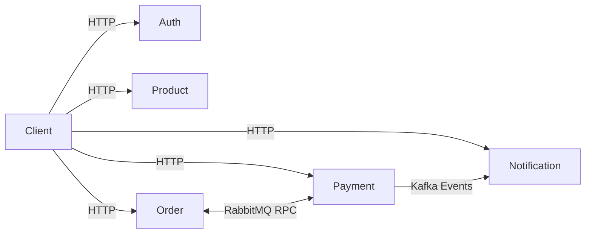

# Order Processing System (NestJS Microservices)

A **scalable microservices architecture** built with **NestJS**. This project highlights:

* **Service-to-service communication** using **RabbitMQ (RPC)** and **Kafka (event streaming)**
* **Swagger** for fully documented REST APIs
* **Docker & Docker Compose** for containerized deployment
* Clean modular design separating concerns across different services

This repository is a showcase of microservices skills, infrastructure setup, and event-driven workflows.

---

## 🏗️ Architecture Overview

* **Auth Service** → Manages authentication & users
* **Product Service** → Handles product catalog & inventory
* **Order Service** → Places/tracks orders, communicates with Payment via RabbitMQ
* **Payment Service** → Processes payments, emits Kafka events
* **Notification Service** → Listens to Kafka events and generates notifications

**Message Brokers:**

* **RabbitMQ** → Synchronous RPC communication between Order ↔ Payment
* **Kafka** → Asynchronous event streaming from Payment → Notification



---

## 📑 API & Swagger Docs

Each service provides a REST API with **Swagger documentation**:

| Service      | Base URL                                       | Swagger Docs                                             |
| ------------ | ---------------------------------------------- | -------------------------------------------------------- |
| Auth         | [http://localhost:7000](http://localhost:7000) | [http://localhost:7000/docs](http://localhost:7000/docs) |
| Order        | [http://localhost:7001](http://localhost:7001) | [http://localhost:7001/docs](http://localhost:7001/docs) |
| Notification | [http://localhost:7002](http://localhost:7002) | [http://localhost:7002/docs](http://localhost:7002/docs) |
| Payment      | [http://localhost:7003](http://localhost:7003) | [http://localhost:7003/docs](http://localhost:7003/docs) |
| Product      | [http://localhost:7004](http://localhost:7004) | [http://localhost:7004/docs](http://localhost:7004/docs) |

**Broker Dashboards:**

* RabbitMQ UI → [http://localhost:15672](http://localhost:15672)
* Kafka Broker → `localhost:9092`

---

## 🚀 Running with Docker

### Prerequisites

* Node.js 18+
* Docker & Docker Compose

### Start all services

```bash
docker compose up --build -d
```

### Stop services

```bash
docker compose down
```

### View logs

```bash
docker compose logs -f
```

---

## ⚙️ Local Development

Run services individually as standard NestJS apps:

```bash
cd order
npm install
npm run start:dev
```

To run only brokers (without Docker for services):

```bash
docker compose up -d rabbitmq zookeeper kafka
```

---

## 🌍 Environment Variables

Each service uses a `.env` file. Common variables include:

* `PORT=700x`
* `RABBITMQ_URL=amqp://rabbitmq:5672`
* `KAFKA_BROKER=kafka:9092`

---

## 🔄 Example Flow

1. Client places an order → **Order Service** (HTTP)
2. Order requests payment → **Payment Service** (RabbitMQ RPC)
3. Payment publishes event → `payment_success` / `payment_failed` (Kafka)
4. **Notification Service** consumes event and creates a notification

---

## 🛠️ Tech Highlights

* **NestJS Microservices** for modular service design
* **RabbitMQ & Kafka** for hybrid messaging
* **Swagger** for API documentation
* **Docker & Docker Compose** for containerized orchestration

---

## 📌 Key Takeaways

* Demonstrates **Dockerized Microservices** with NestJS
* Showcases **Swagger-driven API design**
* Implements **RabbitMQ RPC** & **Kafka event streaming**
* Production-style setup with **Docker Compose orchestration**

---
